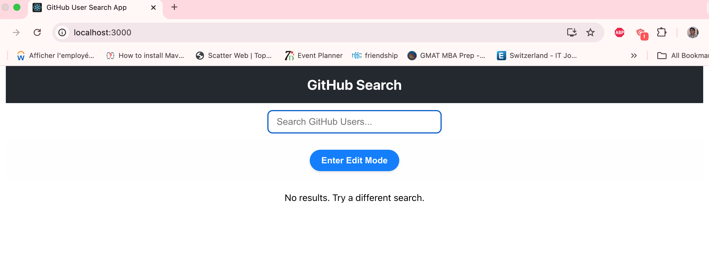
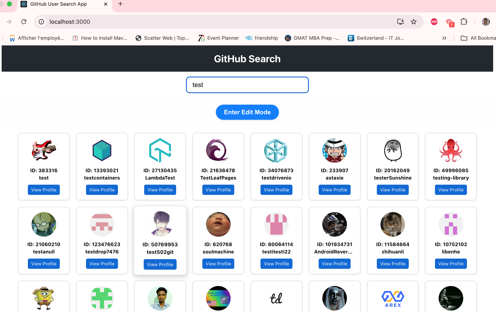
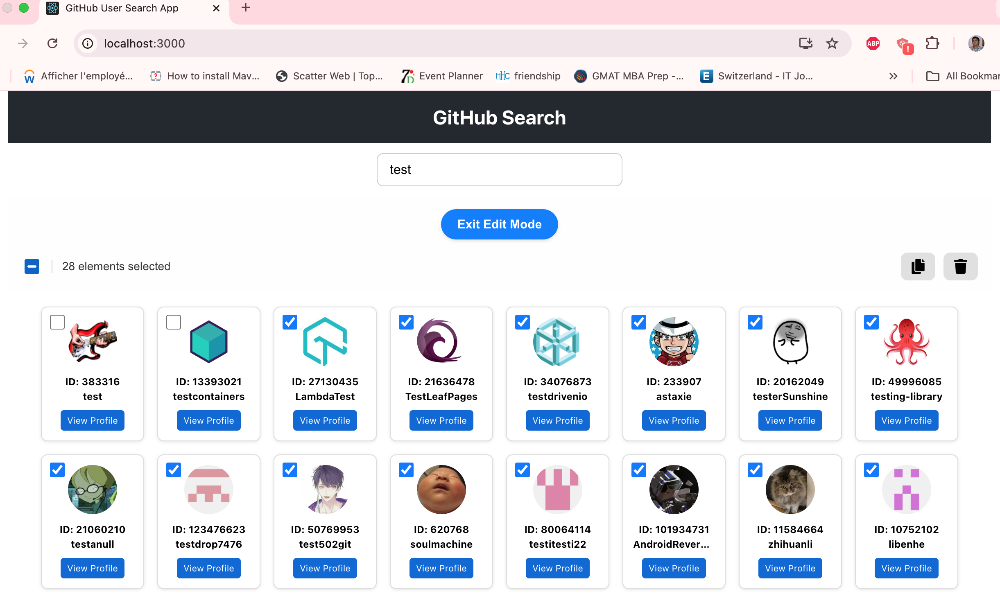
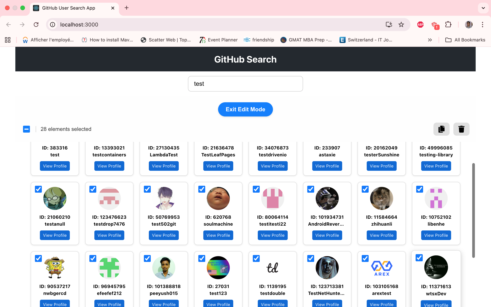
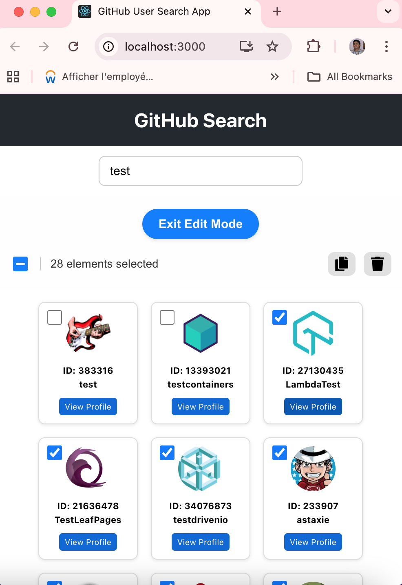

# GitHub User Search

A responsive React application to search and manage GitHub users.  
This project was submitted as part of a technical interview assignment, and was bootstrapped with [Create React App](https://github.com/facebook/create-react-app).

---

## 🗂 Repository Structure

```text
.
├─ README.md                  # This file
├─ AlgorithmTask/             
│   └─ solution.ts            # Algorithm task submission
├─ Frontend/                  # React frontend project
│   ├─ public/
│   │   ├─ favicon.ico
│   │   ├─ index.html
│   │   ├─ logo192.png
│   │   ├─ logo512.png
│   │   ├─ manifest.json
│   │   ├─ placeholder.png    # Fallback avatar
│   │   └─ robots.txt
│   ├─ src/
│   │   ├─ components/
│   │   │   ├─ search-bar/
│   │   │   ├─ toolbar/
│   │   │   ├─ user-card/
│   │   │   └─ user-list/
│   │   ├─ hooks/
│   │   │   └─ useDebounce.ts
│   │   ├─ interfaces/
│   │   │   ├─ index.ts
│   │   │   ├─ search.interface.ts
│   │   │   ├─ toolbar.interface.ts
│   │   │   └─ user.interface.ts
│   │   ├─ services/
│   │   │   └─ github.ts
│   │   ├─ App.css
│   │   ├─ App.test.tsx
│   │   └─ App.css
│   └─ package.json
```
---

## ⚡ Features

- **Search GitHub users** by username with live search and debounce
- **Edit mode**: select, duplicate, or delete users
- **Responsive UI**: works on desktop, tablet, and mobile devices
- **Accessibility**: ARIA labels, keyboard focusable components
- **Fallback avatar** when GitHub profile image fails to load
- **Optimized rendering** with `React.memo` and hooks
- **Detailed JSDoc comments** for all major components

---

## 🎨 Components Overview

- **`SearchBar`**: Input with debounce, responsive width, placeholder, and `Escape` key clearing
- **`Toolbar`**: Edit mode toggle, select all, duplicate, delete actions
- **`UserList`**: Displays list of users, highlights selected users
- **`UserCard`**: Individual user info card with avatar, ID, login, and GitHub profile link
- **`useDebounce` Hook**: Handles input debounce for smoother API calls
- **`fetchGithubUsers` Service**: Fetches users from GitHub API with error handling and abort support

---

## ⚙️ Getting Started

### Navigate to the Frontend folder

```bash
cd Frontend
```

### 🛠️ Install Dependencies

```bash
npm install
```

### ▶️ Run the app in development mode

```bash
npm run start
```

Then open http://localhost:3000 in your browser.

---

## 📱 Responsive Design

- **Desktop**: Wide search bar, centered layout  
- **Tablet (`≤768px`)**: Search bar and components adjust width proportionally  
- **Mobile (`<400px`)**: Components shrink naturally to fit the viewport  
- **Fallback widths**: Ensure no element breaks on extremely small screens

---

## 📂 Algorithm Task

The algorithm task is submitted separately under `AlgorithmTask/solution.ts`.

---

## 🛠 Tech Stack

- **React** 19  
- **TypeScript** 4.9  
- **React Icons**  
- **CSS Flexbox & Media Queries**  
- **Fetch API** with `AbortController`  
- **JSDoc** for documentation

---

## ✅ Notes

- `public/placeholder.png` used as fallback for user avatars  
- Components use `React.memo` to prevent unnecessary re-renders  
- All code is fully documented with JSDoc comments  
- The repo is structured to separate frontend project from algorithm task submission

---

## 📸 Screenshots

### Empty Search

<br/> 

### Normal Search

<br/> 

### Edit Mode (Not all entries selected)

<br/> 

### Content Scroll

<br/> 

### Small Screen (Responsiveness)
